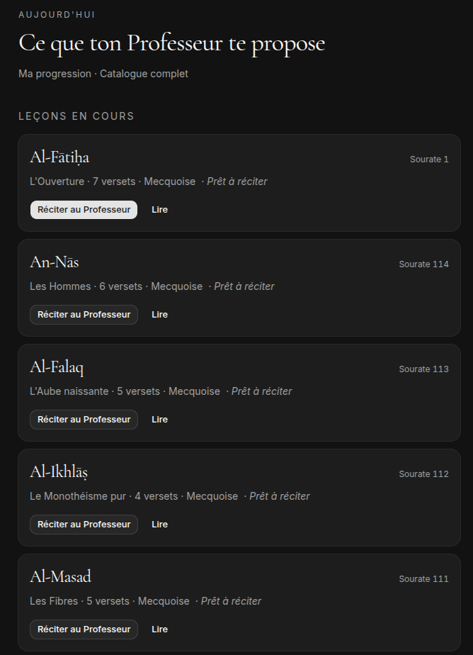
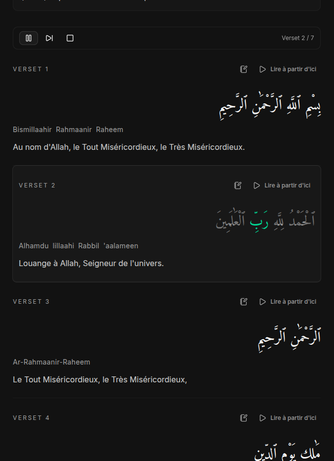
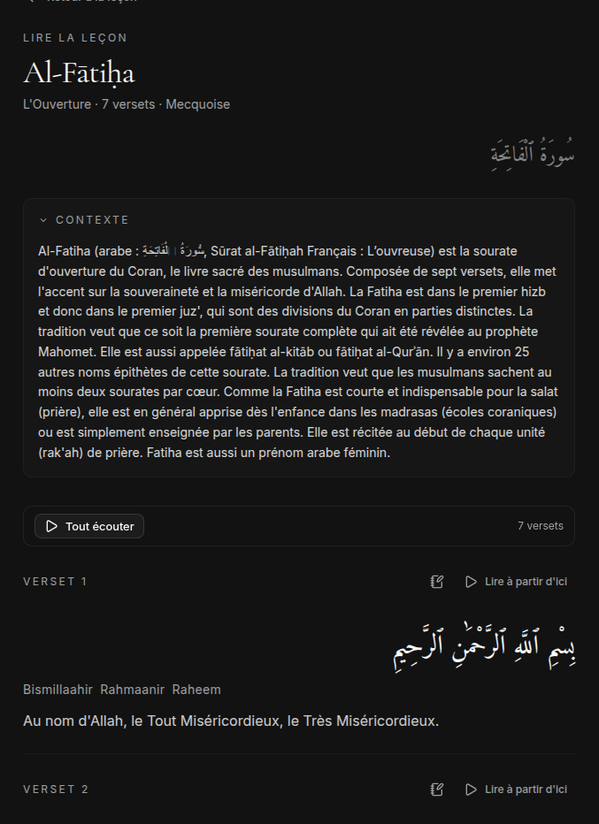
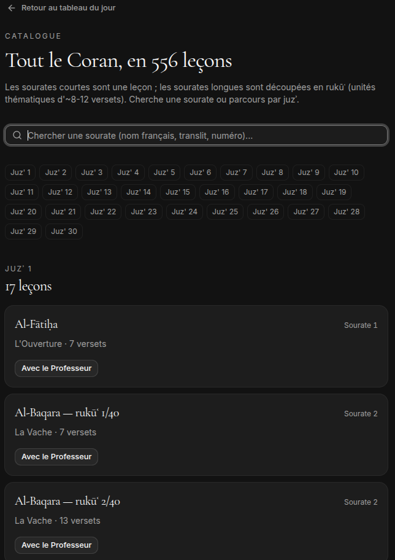

# Le Coran — avec ton Professeur

Application web (PWA) pour mémoriser et comprendre le Coran, en français — du déchiffrage jusqu'au Hifz complet, sur plusieurs années. L'app joue le rôle d'un **professeur de Coran (شيخ)**, et tu es son élève. Pas de deck, pas de streak, pas de points — des leçons, des récitations, et un Professeur qui se souvient de ce que tu dois réviser.

👉 **[coran-learning.vercel.app](https://coran-learning.vercel.app)**

<p align="center">
  
  
</p>

## Comment ça marche



Chaque leçon est un **chunk** naturel du Coran : une sourate entière si elle est courte, sinon un rukūʿ (unité thématique de ~8–12 versets). Une leçon se vit en trois moments, à ton rythme — elle peut s'étaler sur plusieurs jours :

- **Avec le Professeur** (`/lesson`) — introduction guidée : lecture mot à mot, sens, traduction (Hamidullah), translittération, audio verset par verset.
- **En autonomie** (`/practice`) — pratique libre : écoute, répétition, texte masqué progressivement.
- **Réciter au Professeur** (`/recite`) — tu récites de mémoire en t'enregistrant au micro, tu te réécoutes, puis tu t'évalues verset par verset. Pas de reconnaissance vocale, et c'est un choix : dans la méthode traditionnelle aussi, l'élève récite et écoute son propre retour — c'est toi qui juges. Le verdict final fait avancer la leçon vers la maîtrise.



À côté des leçons :

- **Lecture** (`/read`) — lire n'importe quel passage, avec audio et traduction, sans objectif de mémorisation.
- **Catalogue** (`/catalogue`) — vue d'ensemble des 114 sourates et de ta progression.
- **Statistiques** (`/stats`) — ce qui est appris, en cours, à réviser.

### Révision (murājaʿa)

Le planificateur de révision suit les cycles traditionnels du Hifz avec trois files : **sabaq** (la leçon récente), **sabqi** (les leçons des derniers jours) et **manzil** (le répertoire ancien). C'est la mémoire à long terme du Professeur : c'est lui qui décide quoi réviser aujourd'hui.

### Hors ligne

C'est une PWA installable : l'audio écouté est mis en cache, et les actions effectuées hors ligne (progression, notes) sont synchronisées au retour du réseau.

## Choix techniques

- **Planificateur de révision à trois files** — sabaq / sabqi / manzil modélisent les cycles traditionnels du Hifz ; seule la file manzil est pilotée par la répétition espacée ([FSRS](https://github.com/open-spaced-repetition/ts-fsrs)). La leçon en cours ne passe jamais par un algorithme : elle suit une machine à états explicite (`not_started → introduced → learning ⇄ ready_to_recite → recited → mastered`).
- **Synchro hors ligne par outbox** — les mutations faites hors ligne (progression, évaluations, notes) sont écrites dans IndexedDB (Dexie) puis rejouées vers le serveur au retour du réseau. Server-first assumé : le serveur reste la source de vérité, pas de local-first intégral ni de CRDT.
- **Audio synchronisé mot à mot** — les timings par mot de la récitation de Husary sont ingérés en base, ce qui permet la surbrillance du mot actif pendant l'écoute et la lecture suivie.

## Sources et remerciements

- Texte arabe et découpage en rukūʿ : [Tanzil](https://tanzil.net/)
- Traduction française : Muhammad Hamidullah, via [QuranEnc](https://quranenc.com/)
- Audio : récitation de Cheikh Mahmoud Khalil al-Husary, via [everyayah.com](https://everyayah.com/)
- Police coranique : KFGQPC (Complexe du Roi Fahd pour l'impression du Noble Coran)

## Stack technique

Next.js 16 (App Router) · React 19 · TypeScript · Tailwind CSS 4 · shadcn/ui · Auth.js v5 (Google) · Neon Postgres + Drizzle ORM · TanStack Query · Dexie · ts-fsrs · déployé sur Vercel.

## Développement

```bash
npm install
npm run dev
```

Prérequis : un fichier `.env.local` avec `DATABASE_URL` (Neon Postgres), `AUTH_SECRET`, `AUTH_GOOGLE_ID` / `AUTH_GOOGLE_SECRET`, et `ADMIN_EMAILS` pour l'accès admin.

La base doit ensuite être créée et remplie :

```bash
npm run db:push         # applique le schéma Drizzle
npm run ingest:quran    # texte arabe, traduction, découpage en chunks
npm run ingest:segments # timings audio mot à mot
```

Autres commandes utiles :

```bash
npm run test       # tests unitaires (vitest)
npm run typecheck  # tsc --noEmit
npm run lint
```

## Licence

Code sous licence [MIT](LICENSE). Le texte coranique, les traductions et l'audio appartiennent à leurs sources respectives (voir ci-dessus).
